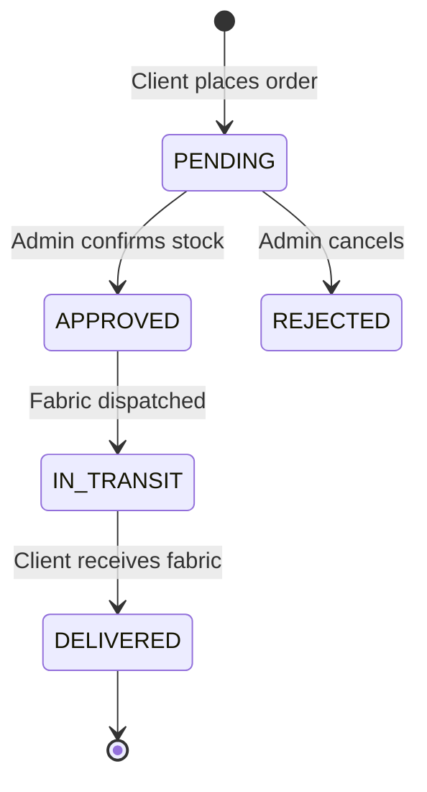
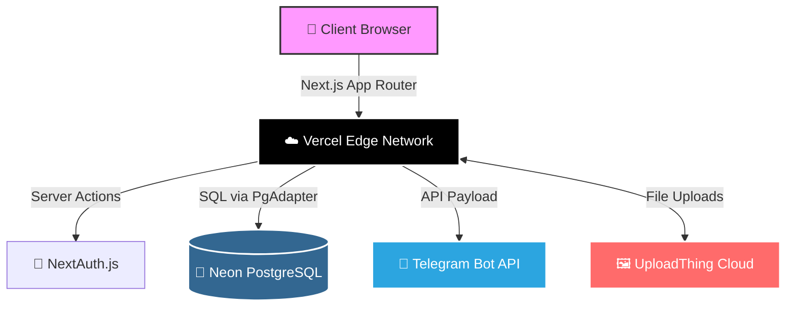

<div align="center">
  <br />
  <h1>🧵 Stitcher Fashion</h1>
  <p><strong>A Premium B2B Fabric Catalog & Order Management Platform</strong></p>
  
  [](https://nextjs.org/)
  [](https://www.typescriptlang.org/)
  [](https://www.prisma.io/)
  [](https://postgresql.org)
  [](https://tailwindcss.com/)
  <br />

  🌍 **Live Production Link:** [https://stitcher-inky.vercel.app](https://stitcher-inky.vercel.app)
  <br />
  🤖 **Telegram Order Bot:** [https://t.me/stitcherorderbot](https://t.me/stitcherorderbot)
</div>

<hr />

## ✨ Features

- **🛒 Dynamic Catalog Management:** Admins can create and manage fabric catalogs, complete with robust stock tracking down to the meter.
- **📦 Intelligent Order Pipeline:** Track orders seamlessly from placement to delivery.
- **🔐 Role-Based Access Control:** NextAuth integration strictly separates `ADMIN` and `CLIENT` privileges.
- **📱 Instant Notifications:** A dedicated Telegram bot instantly alerts the admin team the moment a client places an order.
- **☁️ Cloud-Native Image Hosting:** Secure, fast image uploads powered by UploadThing.
- **🎨 Premium UI/UX:** Responsive, smooth, and heavily animated user interface built with Tailwind CSS.

## 🔄 Order Pipeline Flow

The platform enforces a strict, logical state machine for every order to ensure clients and admins are always in sync.



## 🏗️ System Architecture

Stitcher leverages modern serverless edge architecture, connecting a Next.js App Router frontend directly to a Serverless Neon PostgreSQL database via Prisma ORM.



## 🧪 Test Accounts

If you are exploring the application, you can use the following test accounts:

### 👑 Admin Account
*(Has access to the Admin Dashboard to manage catalogs, inventory, and approve orders)*
- **Email:** `admin@stitcher.com`
- **Password:** `admin123`

### 👤 Client Account
*(Standard user account to place orders, view order history, and track status)*
- **Email:** `client@stitcher.com`
- **Password:** `client123`

## 💻 Local Development Setup

To run this project locally, follow these steps:

**1. Clone the repository and install dependencies:**
```bash
git clone https://github.com/siraajul/stitcher.git
cd stitcher
npm install
```

**2. Configure Environment Variables:**
Create a `.env` file in the root of the project with the following keys:
```env
# Database
DATABASE_URL="postgresql://<user>:<password>@<host>/<db>"

# NextAuth
AUTH_SECRET="your-auth-secret"

# UploadThing
UPLOADTHING_TOKEN="your-uploadthing-token"

# Telegram Bot
TELEGRAM_BOT_TOKEN="your-telegram-bot-token"
TELEGRAM_CHAT_ID="your-chat-id"
```

**3. Initialize Database:**
```bash
npx prisma generate
```

**4. Start the development server:**
```bash
npm run dev
```

Open [http://localhost:3000](http://localhost:3000) with your browser to see the result.
